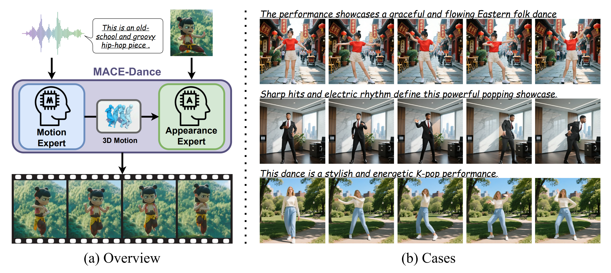

<p align="center">
  <h1 align="center">🎵 MACE-Dance</h1>
  <h3 align="center">Motion-Appearance Cascaded Experts for Music-Driven Dance Video Generation</h3>
<p align="center">
    Kaixing Yang<sup>1</sup> ·
    Jiashu Zhu<sup>2,*</sup> ·
    Xulong Tang<sup>5</sup> ·
    Ziqiao Peng<sup>1</sup> ·
    Xiangyue Zhang<sup>4</sup>
    <br>
    Puwei Wang<sup>1,†</sup> ·
    Jiahong Wu<sup>2,†</sup> ·
    Xiangxiang Chu<sup>2</sup> ·
    Hongyan Liu<sup>3,†</sup> ·
    Jun He<sup>1</sup>
    <br><br>
    <sup>1</sup>Renmin University of China &nbsp;
    <sup>2</sup>AMap, Alibaba &nbsp;
    <sup>3</sup>Tsinghua University &nbsp;
    <sup>4</sup>Wuhan University &nbsp;
    <sup>5</sup>Malou Tech Inc
    <br><br>
    <sup>*</sup>Project Leader &nbsp;
    <sup>†</sup>Corresponding Authors
</p>

  <p align="center">
    <a href="https://arxiv.org/abs/2512.18181">
      
    </a>
    <a href="https://macedance.github.io/">
      
    </a>
    <a href="#">
      
    </a>
  </p>
</p>

<p align="center">
  
</p>

<p align="center">
  <em>
    MACE-Dance is a cascaded expert framework for music-driven dance video generation,
    explicitly decoupling motion generation and appearance synthesis to produce
    kinematically plausible, artistically expressive, and visually coherent dance videos.
  </em>
</p>

---

## ✨ Overview

**MACE-Dance** is the official PyTorch implementation of the SIGGRAPH 2026 paper:

> **MACE-Dance: Motion-Appearance Cascaded Experts for Music-Driven Dance Video Generation**

Music-driven dance video generation is challenging because it requires simultaneously modeling:

- **Motion quality**: kinematically plausible and artistically expressive dance motion
- **Appearance quality**: high-fidelity visual synthesis with strong spatiotemporal consistency

To address this, **MACE-Dance** decomposes the task into two cascaded experts:

- **🕺 Motion Expert**: generates music-aligned **3D dance motion**
- **🎨 Appearance Expert**: synthesizes the final **dance video** conditioned on motion and reference appearance

Instead of using 2D keypoints as the intermediate representation, MACE-Dance adopts **3D SMPL motion**, which provides better spatial fidelity, cleaner supervision, and stronger robustness for downstream video synthesis.

---

## 🧩 Repository Structure

```bash
MACE-Dance/
├── Expert-Motion/           # Motion Expert: music-to-3D dance motion
├── Expert-Appearance/       # Appearance Expert: motion-guided video synthesis
├── Evaluation-Motion/       # Motion-dimension evaluation
├── Evaluation-Appearance/   # Appearance-dimension evaluation
├── teaser.png
└── README.md
```
---

## 📚 MA-Data Dataset

We provide **MA-Data**, a large-scale dataset for music-driven dance video generation, containing **~70K video clips** spanning **116 hours** across **20+ dance genres**. Please refer to the [dataset page](https://huggingface.co/datasets/GD-ML/MACE-Dance) for more details.


---

## 🏋️ Model Weights

The source code for **MACE-Dance** is fully open-source. For the model weights of the Appearance Expert, please visit the link below to request access or download:

👉 **[Click here to access MACE-Dance Model Weights](https://huggingface.co/GD-ML/MACE-Dance)**

---

## 📏 Evaluation Protocol

We provide a motion–appearance evaluation protocol for music-driven dance video generation, including motion quality assessment based on ViTPose keypoints and appearance quality assessment based on VBench. Please refer to `Evaluation-Motion` and `Evaluation-Appearance` for details.

---

## 📌 Notes

- The repository is organized into **expert modules** and **evaluation modules**.
- Please check the subfolder READMEs for environment setup, inference, and evaluation details.
- Some released example files are for demonstration only; please replace them with your own predictions / ground-truth files during evaluation.

---

## 📄 Citation

If you find this project useful, please consider citing our paper:

```bibtex
@inproceedings{yang2026macedance,
  title={MACE-Dance: Motion-Appearance Cascaded Experts for Music-Driven Dance Video Generation},
  author={Yang, Kaixing and Zhu, Jiashu and Tang, Xulong and Peng, Ziqiao and Zhang, Xiangyue and Wang, Puwei and Wu, Jiahong and Chu, Xiangxiang and Liu, Hongyan and He, Jun},
  booktitle={Proceedings of the ACM SIGGRAPH Conference},
  year={2026}
}
```

---

## 🙏 Acknowledgement

This work was supported in part by the National Nature Science Foundation of China under Grants **62436010**, **72572090**, **62572474**, and **62172421**, and in part by the Tsinghua University School of Economics and Management Research Grant.
